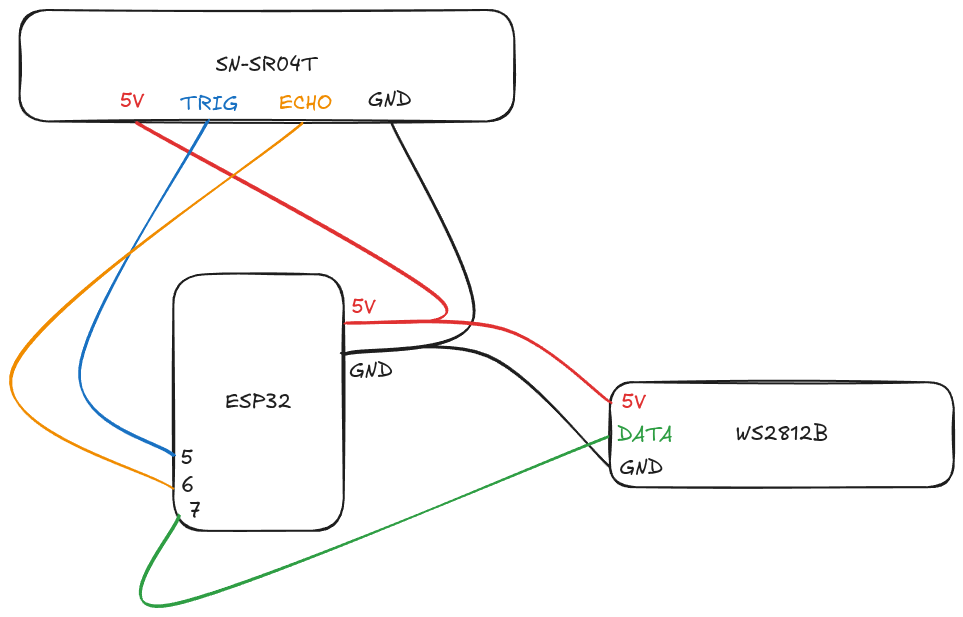

# ESP32 Parking Sensor

Sistema intelligente di assistenza al parcheggio basato su ESP32 con indicatore visivo a LED che cambia colore in base alla distanza rilevata.

## Caratteristiche

- **Indicatore visivo progressivo**: striscia LED che cambia colore (verde → giallo → arancione → rosso) in base alla distanza
- **Modalità standby intelligente**: il sistema si attiva solo quando rileva movimento, riducendo il consumo energetico
- **Allarme di prossimità**: LED rosso lampeggiante quando si è troppo vicini al muro
- **Polling adattivo**: frequenza di campionamento variabile per ottimizzare le prestazioni

## Bill of Material

| Componente | Descrizione | Quantità | Link |
|------------|-------------|----------|------|
| ESP32-S3 | Microcontrollore principale | 1 | [Link](https://it.aliexpress.com/item/1005009835380864.html?spm=a2g0o.order_list.order_list_main.5.61913696RwrKpP&gatewayAdapt=glo2ita) |
| JSN-SR04T | Sensore ultrasonico waterproof | 1 | [Link](https://www.amazon.it/dp/B0DJX8V8LD?ref_=ppx_hzsearch_conn_dt_b_fed_asin_title_1) |
| WS2812B | Striscia LED RGB indirizzabile | 1 (12 LED) | [Link](https://www.amazon.it/dp/B01NBC5CTH?ref=ppx_yo2ov_dt_b_fed_asin_title)|
| Cavi jumper | Per collegamenti | - | [Link](https://www.amazon.it/AZDelivery-Cavetti-Maschio-Femmina-Raspberry/dp/B074P726ZR/ref=sr_1_3_sspa?dib=eyJ2IjoiMSJ9.mSTTTMP7vIRIhzCC8wmMIUgh4bFPr1TFqGR0cL2XCvgrk2yA_ubjCUGDk3-JuGYYCGmm-PoY20L4VGFUuA_WfIhE9m9U0qsaxpFiLzO5bG9cBD1LtCjw2v7wrva0bhH9vRLfzTBX5jyphrl2CNOXAzoT64B6wTvx9D8entwgjGbBRmAXzPPa_hJq9j2P90BmLp1DdzkLJqrGgrwmNzkPSY4G2LzM7McEwCbchAQ1XRwZxQu8w0SVMzSIKaQtQO0ujzH9_88eFKgpp2xxJDUZkxs_Qgm6Q0hJ9Ie4sF55ws8.FQD32wqrrR2pR1MYDRuNhSCB8DnUpKTpJLzUidZZhZs&dib_tag=se&keywords=breadboard%2Bcable&qid=1770827081&sr=8-3-spons&aref=R1vDOpPAKo&sp_csd=d2lkZ2V0TmFtZT1zcF9hdGY&th=1) |

## Schema di Collegamento Elettrico



```
ESP32-S3          JSN-SR04T
---------         ----------
GPIO 5    ----→   TRIG
GPIO 6    ←----   ECHO
5V        ----→   VCC
GND       ----→   GND

ESP32-S3          WS2812B
---------         --------
GPIO 7    ----→   DIN (Data In)
5V        ----→   VCC
GND       ----→   GND
```

### Note sui Collegamenti
- **Alimentazione**: Assicurarsi che l'alimentatore usato per alimentare l'ESP32 abbia una potenza sufficiente ad aliemntare anche la striscia a LED.

## Come Flashare il Programma su ESP32

### Prerequisiti

1. **Arduino IDE**: scaricare e installare da [arduino.cc](https://www.arduino.cc/en/software)
2. **Supporto ESP32**: installare il core ESP32 per Arduino IDE
   - Aprire Arduino IDE
   - Andare in `File` → `Preferences`
   - Aggiungere questo URL nelle "Additional Board Manager URLs":
     ```
     https://raw.githubusercontent.com/espressif/arduino-esp32/gh-pages/package_esp32_index.json
     ```
   - Andare in `Tools` → `Board` → `Board Manager`
   - Cercare "esp32" e installare "esp32 by Espressif Systems"

3. **Libreria Adafruit NeoPixel**: necessaria per controllare la striscia LED
   - Andare in `Sketch` → `Include Library` → `Manage Libraries`
   - Cercare "Adafruit NeoPixel"
   - Installare "Adafruit NeoPixel by Adafruit"

### Procedura di Flash

1. Aprire il file [parkingsensor/parkingsensor.ino](parkingsensor/parkingsensor.ino) con Arduino IDE

2. Selezionare la scheda ESP32:
   - Andare in `Tools` → `Board` → `ESP32 Arduino` → `ESP32S3 Dev Module`
   - (Se si usa un'altra variante di ESP32, selezionare quella appropriata)

3. Configurare le impostazioni della porta:
   - Collegare l'ESP32 al computer via USB
   - Andare in `Tools` → `Port` e selezionare la porta COM/ttyUSB* corrispondente

4. Configurazione consigliata per ESP32-S3:
   - USB CDC On Boot: `Enabled`
   - Upload Mode: `UART0 / Hardware CDC`
   - USB Mode: `Hardware CDC and JTAG`

5. Cliccare sul pulsante `Upload` (freccia destra) per compilare e caricare il programma

6. Aprire il Serial Monitor (`Tools` → `Serial Monitor`) impostato a 115200 baud per vedere i messaggi di debug

### Risoluzione Problemi

- **ESP32 non rilevato**: provare a premere il pulsante BOOT sull'ESP32 mentre si avvia l'upload
- **Errore di compilazione**: verificare che tutte le librerie siano installate correttamente
- **Upload fallito**: controllare che la porta seriale sia quella corretta e che non sia utilizzata da altri programmi

## Variabili e Cosa Fanno

### Pin di Connessione

| Variabile | Valore | Descrizione |
|-----------|--------|-------------|
| `TRIG_PIN` | 5 | Pin GPIO per il segnale TRIGGER del sensore ultrasonico |
| `ECHO_PIN` | 6 | Pin GPIO per ricevere il segnale ECHO dal sensore |
| `LED_PIN` | 7 | Pin GPIO per controllare la striscia LED WS2812B |
| `NUM_LEDS` | 12 | Numero di LED nella striscia (modificare in base alla propria striscia) |

### Soglie di Distanza (in cm)

| Variabile | Valore | Descrizione |
|-----------|--------|-------------|
| `DIST_DETECTION` | 200 | Distanza massima di rilevamento (2 metri). Se un oggetto è rilevato entro questa distanza, il sistema si attiva |
| `DIST_GREEN` | 100 | Distanza sicura (>100 cm) - LED verdi |
| `DIST_YELLOW` | 75 | Zona di attenzione (75-100 cm) - LED gialli |
| `DIST_ORANGE` | 55 | Zona di cautela (55-75 cm) - LED arancioni |
| `DIST_RED` | 35 | Zona di pericolo (35-55 cm) - LED rossi fissi |
|  | <35 | Zona critica (<35 cm) - LED rossi lampeggianti |

### Parametri di Timing (in millisecondi)

| Variabile | Valore | Descrizione |
|-----------|--------|-------------|
| `INACTIVITY_TIMEOUT` | 30000 | Tempo di inattività (30 secondi) dopo il quale il sistema entra in modalità standby se non rileva movimenti |
| `IDLE_POLL_RATE` | 2000 | Frequenza di polling lenta (2 secondi) quando il sistema è in standby per risparmiare energia |
| `ACTIVE_POLL_RATE` | 50 | Frequenza di polling veloce (50 ms) quando il sistema è attivo per una risposta reattiva |
| `MOVEMENT_THRESHOLD` | 10 | Sensibilità al movimento (10 cm). Variazioni superiori a questa soglia vengono considerate movimento |
| `REACTIVATION_THRESHOLD` | 20 | Soglia di riattivazione (20 cm). Il sistema si riattiva se rileva un cambiamento superiore a questa distanza rispetto all'ultimo oggetto statico rilevato |

### Personalizzazione

Puoi modificare queste variabili all'inizio del file [parkingsensor.ino](parkingsensor/parkingsensor.ino) per adattare il comportamento del sistema alle tue esigenze:

- **Aumentare `INACTIVITY_TIMEOUT`**: per sistemi che devono rimanere attivi più a lungo
- **Ridurre `MOVEMENT_THRESHOLD`**: per rendere il sistema più sensibile ai piccoli movimenti
- **Modificare le soglie di distanza**: per adattare i colori LED alle dimensioni del proprio garage
- **Cambiare `NUM_LEDS`**: in base alla lunghezza della propria striscia LED

## Funzionamento

1. **Avvio**: all'accensione, il sistema entra in modalità standby e attende il rilevamento di un oggetto
2. **Rilevamento**: quando un oggetto entra nel raggio di 2 metri, il sistema si attiva
3. **Indicazione visiva**: i LED cambiano colore in base alla distanza:
   - 🟢 Verde: distanza sicura (>100 cm)
   - 🟡 Giallo: attenzione (75-100 cm)
   - 🟠 Arancione: cautela (55-75 cm)
   - 🔴 Rosso fisso: pericolo (35-55 cm)
   - 🔴 Rosso lampeggiante: critico (<35 cm)
4. **Standby intelligente**: se non viene rilevato movimento per 30 secondi, il sistema spegne i LED ma continua a monitorare
5. **Riattivazione**: il sistema si riattiva automaticamente quando rileva un nuovo movimento significativo

## Debug

Il sistema invia continuamente informazioni sulla porta seriale. Per visualizzarle:

1. Aprire il Serial Monitor in Arduino IDE
2. Impostare la velocità a 115200 baud
3. Osservare i messaggi di debug che mostrano:
   - Distanza rilevata in tempo reale
   - Stato del sistema (Active/Standby)
   - Eventi di movimento
   - Transizioni di stato

## Licenza

Questo progetto è rilasciato come open source. Sentiti libero di modificarlo e adattarlo alle tue esigenze.